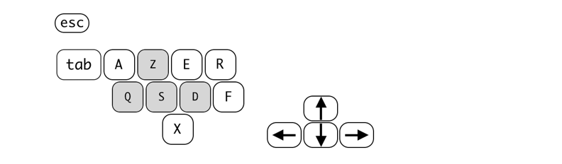
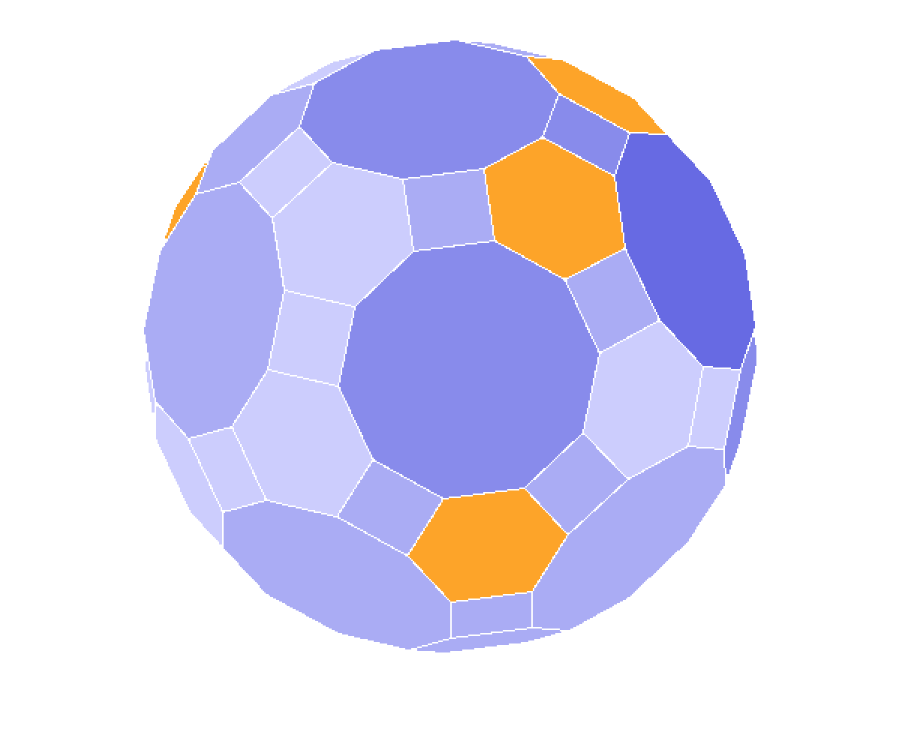

# Minesweeper

This project is a part of a school assignment achieved by a team.

It's about a 3D minesweeper in the functional language [Racket](http://racket-lang.org). In this case we used the [typed version](https://docs.racket-lang.org/ts-guide/) of Racket.

The aim were, implement some strategies and then display the whole game. The game is managed as a graph, so the 3D part was here to play on other things that a classic grid.

**Functional paradigm** was respected except in `lib/convex.rkt` for complexity reasons and in `play.rkt` because of [graphics](http://docs.racket-lang.org/graphics/index.html?q=graphics%2Fgraphics) library.

## How to play

Run `play.rkt` in the root of this project.

#### Choose a 3d model

First, using associate letters choose a solid name to play with.

#### Control

Place the mouse on a solid face and press keys to action.

- **E**  reveal a face / query the number a mines around
- **F**  put flag / remove flag
- **Z Q S D**  or  **arrow keys**  to rotate the solid
- **R**  restart
- **X**  or  **esc**  to quit
- **A**  ask for help to put new flags
- **tab**  to help reveal faces using current flags

## Color system

Information in the game works with colors on the solid face and some text.

- <u>Gray</u>  face is for undiscovered face
- <u>Orange</u>  one is for flagged face
- <u>Red</u>  is a mine
- <u>Blue dithering</u>  underline the density of mine around

## Example

a - troncated icosahedron

